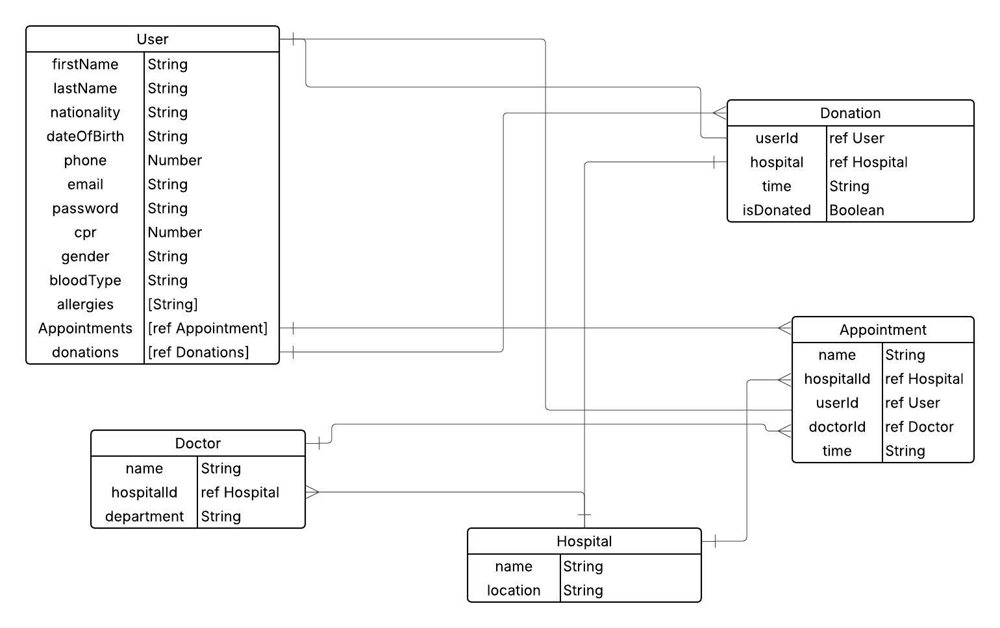
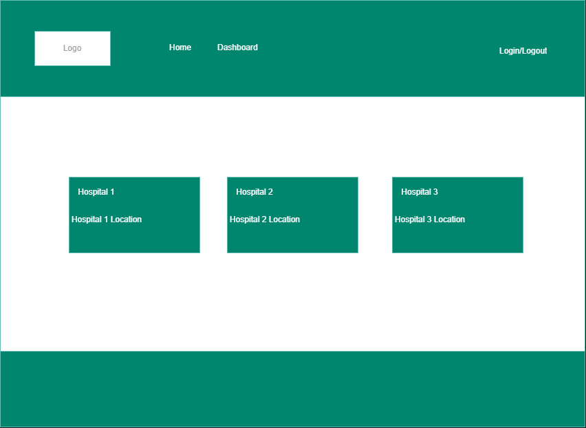
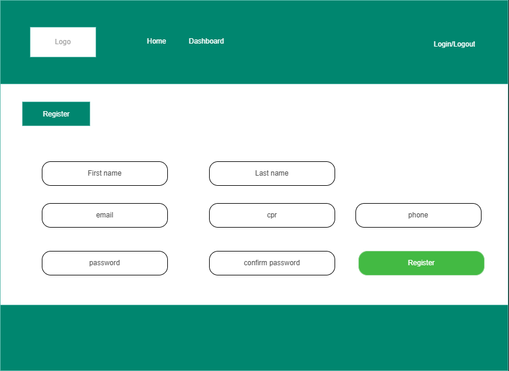
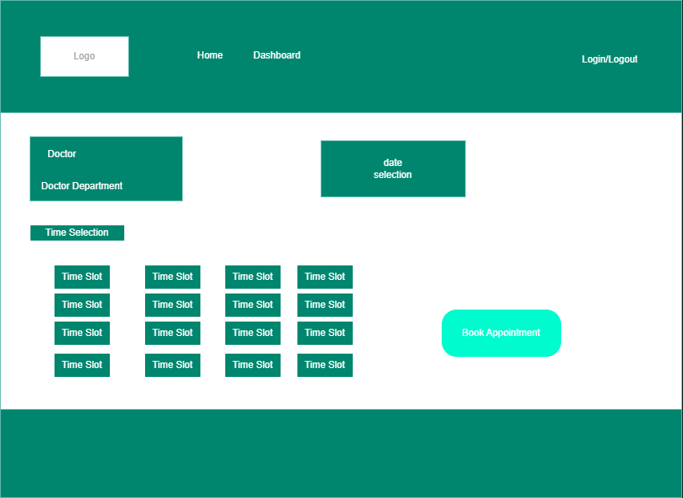

# MedAppoint

## Date: 12/6/2025

### By: Hasan Maaraj, Saud Aljar, Naim Jalal

#### [GitHub](https://github.com/HasanMaaraj) | [GitHub](https://github.com/SAljar99) | [GitHub](https://github.com/Naimjalal)

---

### **_Description_**

**Medappoint** is a full-stack hospital appointment and blood donation system designed to help patients easily book appointments with doctors in busy hospitals like Salmaniya, and register for blood donation.

It aims to solve common issues like:
- Difficulty in finding available appointment slots
- Long waiting times for scheduling
- Lack of centralized donation tracking across hospitals

This backend API manages the data and logic for users, appointments, doctors, hospitals, and blood donations.

---

## Features

- 🔒 User authentication with JWT
- 🩸 Blood donation tracking
- 🗓️ Book, view, and manage appointments
- 🏥 Admins can manage doctors and donations (via database)
- 📍 Multiple hospitals supported
- 📋 MongoDB relationships between users, doctors, hospitals, donations, and appointments

---
## ## 🧩 Entity Relationship Diagram (ERD)

---
## 🛠️ Technologies Used

- Backend: Express.js
- Frontend: React.js
- Database: MongoDB
- JWT (for user authentication)
- ERd LucidChart
- Trello (user stories)

---
## 🔗 Live Links

- 🔗 Frontend Repository: [medappoint-frontend](https://github.com/Naimjalal/medappoint-frontend)

- 🔗 Trello Board: [View Trello](https://trello.com/b/ojg9NhU0/basic-board)

- 🔗 Deployment: _Coming soon on Fly.io_

---

### **_Future Updates_**
- Admin dashboard

- Appointment reminders via email or SMS

- Hospital availability API

- Blood donation notifications

---

### **_Credits_**

##### Markdown Guide: [ia.net](https://ia.net/writer/support/general/markdown-guide)

##### ChatGPT: [chat.openai.com](https://chat.openai.com)

---